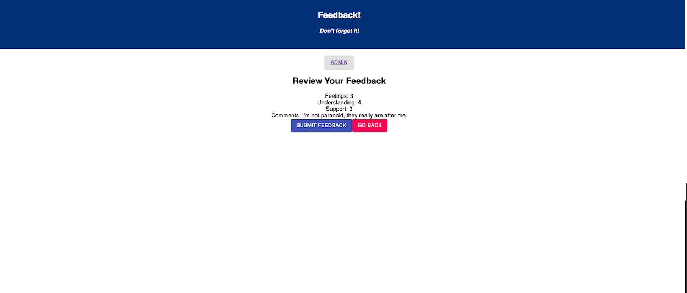
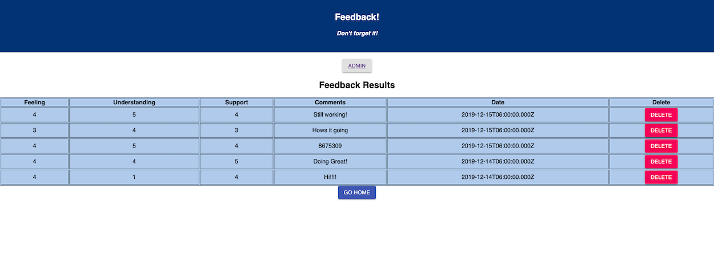

# Redux-Feedback-Loop

## Description
Duration: 15 hours

The Redux-Feedback-Loop is a Single Page Application designed as a daily feedback form. Users may input their feedback by clicking on the radio button of the form, as well as adding a comment in the comment section.

## Screenshots

##Usage
1. Begin the form by clicking on the Start Feedback button.
2. Choose a number between 1 and 5 and click Next to answer, How are you feeling today? Or click Go Back to return to the previous page.
3. Choose a number between 1 and 5 and click Next to answer, How well are you understanding the content? Or click Go Back to return to the previous page.
4. Choose a number between 1 and 5 and click Next to answer, How well are you being supported? Or click Go Back to return to the previous page.
5. Enter any comments you wish to leave in the Comments Input. Click Next to continue or click Go Back to return to the previous page.
6. On the Review page you may click on the Submit Feedback button to submit your feedback to the database. Or click Go Back to return to the previous page.
7. Submitting the form will lead you to a Thank You page. From there you may click on the Leave New Feedback button to start a new feedback form.
8. Below the header of each page is an Admin button, clicking on the Admin button will lead you to the Admin page.
9. The Admin page has a table of all completed feedback forms listed from the most recent to the oldest.
10. Clicking on the Delete button will delete that feedback from the table as well as the database.
11. Clicking on the Go Home button will return you to the home screen.

## Built with
React, Redux, html, CSS, Node, Express, Javascript, PostgreSQL, Logger, Body-Parser, Material-UI

## Acknowledgement
Thanks to Prime Digital Academy in Kansas City who equipped and helped me to make this application a reality. Specifically Scott, Myron, and the Tyto cohort.

## Support
If you have suggestions or issues, please email me at allenlucke@gmail.com

